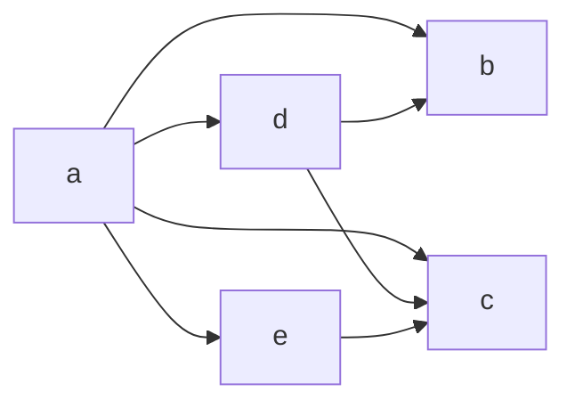
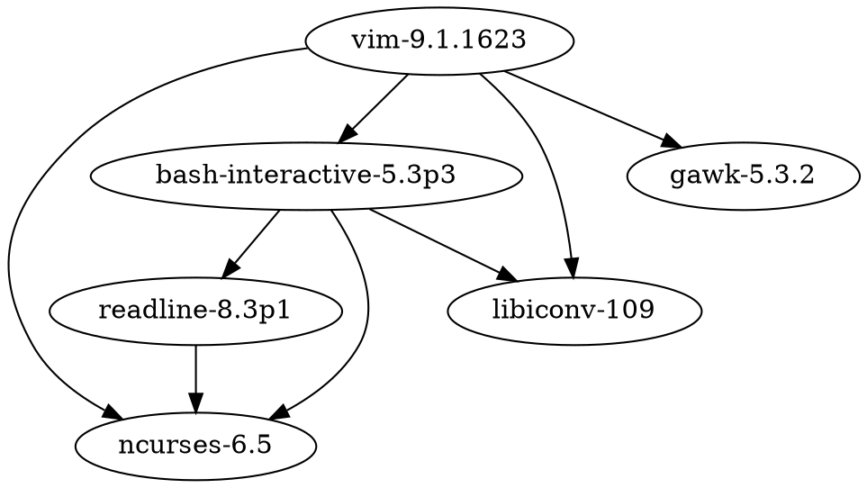

+++
title = "Nix is cool as hell"
date = 2025-10-02
tags = ["nix", "linux", "devops"]
[extra]
image = "image-2.png"
diagram = true
+++

Okay so we are starting with nerd talk, but if you don't wanna hear that skip to [here](#why)


So if you've ever programmed i'm sure you have to deal with dependencies, downloading one thing or another to get something working. On Windows? absolute nightmare. On Mac, can be painful. Linux, ironically can also be extremely painful



<figcaption>average deps moment</figcaption>

Nix trys to fix this by trying to think of all dependencies on your entire system as a graph.



<figcaption>vim dependency graph for nix</figcaption>

and these versions are maintained on your computer

as 

```bash
/nix/store/sha256dksadjksadjkasl-gawk-5.3.2
```

where the package actually links to the *specific* version it needs.


some packages have really complex package dependencies

```graphviz
strict digraph {
  "c-grammar-neovim-0.11.4" -> "libcxx-19.1.7" [];
  "python3.13-greenlet-3.2.3" -> "libcxx-19.1.7" [];
  "python3.13-greenlet-3.2.3" -> "python3-3.13.7" [];
  "luajit-2.1.1741730670-env" -> "luajit-2.1.1741730670" [];
  "tree-sitter-0.25.6" -> "libiconv-109" [];
  "libutil-72" -> "libcxx-19.1.7" [];
  "readline-8.3p1" -> "ncurses-6.5" [];
  "gettext-0.25.1" -> "libcxx-19.1.7" [];
  "gettext-0.25.1" -> "libiconv-109" [];
  "gettext-0.25.1" -> "bash-5.3p3" [];
  "python3.13-pynvim-0.6.0" -> "python3.13-greenlet-3.2.3" [];
  "python3.13-pynvim-0.6.0" -> "python3-3.13.7" [];
  "python3.13-pynvim-0.6.0" -> "bash-5.3p3" [];
  "python3.13-pynvim-0.6.0" -> "python3.13-msgpack-1.1.1" [];
  "query-grammar-neovim-0.11.4" -> "libcxx-19.1.7" [];
  "python3-3.13.7" -> "openssl-3.5.1" [];
  "python3-3.13.7" -> "xz-5.8.1" [];
  "python3-3.13.7" -> "bzip2-1.0.8" [];
  "python3-3.13.7" -> "mpdecimal-4.0.1" [];
  "python3-3.13.7" -> "tzdata-2025b" [];
  "python3-3.13.7" -> "mailcap-2.1.54" [];
  "python3-3.13.7" -> "readline-8.3p1" [];
  "python3-3.13.7" -> "bash-5.3p3" [];
  "python3-3.13.7" -> "zlib-1.3.1" [];
  "python3-3.13.7" -> "ncurses-6.5" [];
  "python3-3.13.7" -> "gdbm-1.25-lib" [];
  "python3-3.13.7" -> "expat-2.7.1" [];
  "python3-3.13.7" -> "sqlite-3.50.2" [];
  "python3-3.13.7" -> "libffi-39" [];
  "python3-3.13.7-env" -> "python3.13-greenlet-3.2.3" [];
  "python3-3.13.7-env" -> "python3.13-pynvim-0.6.0" [];
  "python3-3.13.7-env" -> "python3-3.13.7" [];
  "python3-3.13.7-env" -> "python3.13-msgpack-1.1.1" [];
  "markdown_inline-grammar-neovim-0.11.4" -> "libcxx-19.1.7" [];
  "lua-grammar-neovim-0.11.4" -> "libcxx-19.1.7" [];
  "vim-grammar-neovim-0.11.4" -> "libcxx-19.1.7" [];
  "libluv-1.51.0-1" -> "libuv-1.51.0" [];
  "python3.13-msgpack-1.1.1" -> "python3-3.13.7" [];
  "vimdoc-grammar-neovim-0.11.4" -> "libcxx-19.1.7" [];
  "neovim-0.11.4" -> "c-grammar-neovim-0.11.4" [];
  "neovim-0.11.4" -> "luajit-2.1.1741730670-env" [];
  "neovim-0.11.4" -> "query-grammar-neovim-0.11.4" [];
  "neovim-0.11.4" -> "bash-5.3p3" [];
  "neovim-0.11.4" -> "python3-3.13.7-env" [];
  "neovim-0.11.4" -> "markdown_inline-grammar-neovim-0.11.4" [];
  "neovim-0.11.4" -> "lua-grammar-neovim-0.11.4" [];
  "neovim-0.11.4" -> "vim-grammar-neovim-0.11.4" [];
  "neovim-0.11.4" -> "vimdoc-grammar-neovim-0.11.4" [];
  "neovim-0.11.4" -> "markdown-grammar-neovim-0.11.4" [];
  "neovim-0.11.4" -> "neovim-unwrapped-0.11.4" [];
  "sqlite-3.50.2" -> "zlib-1.3.1" [];
  "markdown-grammar-neovim-0.11.4" -> "libcxx-19.1.7" [];
  "luajit2.1-lpeg-1.1.0-2" -> "luajit-2.1.1741730670" [];
  "neovim-unwrapped-0.11.4" -> "luajit-2.1.1741730670" [];
  "neovim-unwrapped-0.11.4" -> "c-grammar-neovim-0.11.4" [];
  "neovim-unwrapped-0.11.4" -> "libuv-1.51.0" [];
  "neovim-unwrapped-0.11.4" -> "tree-sitter-0.25.6" [];
  "neovim-unwrapped-0.11.4" -> "libutil-72" [];
  "neovim-unwrapped-0.11.4" -> "libiconv-109" [];
  "neovim-unwrapped-0.11.4" -> "gettext-0.25.1" [];
  "neovim-unwrapped-0.11.4" -> "query-grammar-neovim-0.11.4" [];
  "neovim-unwrapped-0.11.4" -> "unibilium-2.1.2" [];
  "neovim-unwrapped-0.11.4" -> "utf8proc-2.10.0" [];
  "neovim-unwrapped-0.11.4" -> "bash-5.3p3" [];
  "neovim-unwrapped-0.11.4" -> "markdown_inline-grammar-neovim-0.11.4" [];
  "neovim-unwrapped-0.11.4" -> "lua-grammar-neovim-0.11.4" [];
  "neovim-unwrapped-0.11.4" -> "vim-grammar-neovim-0.11.4" [];
  "neovim-unwrapped-0.11.4" -> "libluv-1.51.0-1" [];
  "neovim-unwrapped-0.11.4" -> "vimdoc-grammar-neovim-0.11.4" [];
  "neovim-unwrapped-0.11.4" -> "markdown-grammar-neovim-0.11.4" [];
  "neovim-unwrapped-0.11.4" -> "luajit2.1-lpeg-1.1.0-2" [];
}
```



<figcaption>this is for neovim, i know you're not reading this on mobile and barely on desktop</figcaption>

Because each dependency is linked to a specific folder in the nix store with a specific hash associated with it (ignore my fake hashes) the system is reproducible and can be rolled back.

```bash
/nix/store/blabla-neovim-unwrapped-0.11.4
/nix/store/etcetc-markdown_inline-grammar-neovim-0.11.4
```

This idea of linked dependencies and pinned versions of dependencies can in fact be extended to a whole system, installed packages simply become dependencies of the `system` as opposed to individual parts. They become part of a well oiled whole that dedupes and calculates exactly what is needed for your scenario

# Why?

When you have a system that is reproducible and configurable, you stop thinking about losing things. 

Some would say you should just back up all your hard drives, do that one at home, one somewhere else and one in the cloud type backup.

But backing up a whole hard drive with configuration is wasteful and expensive.

The only real things you should be backing up is data like photos or documents.

You don't need to backup an application, you just need to backup that you ***have*** that program, not the program itself. And even better, with a pinned version. You just need to track it. Nix can do that.

 My configuration for my mac, my desktop, my server, **TOTAL** a couple megabytes. I declare my configuration in files and use nix to deploy it. [nix-darwin](https://github.com/nix-darwin/nix-darwin) allows this and is a bit sketchy sometimes because lots of people don't have macs in the nerdy nix community so sometimes packages do work but havent been tested. 

A big problem right now is that apples libraries are a bit of a nightmare to package and programs tend to require code signing. If you're building things yourself, you don't tend to have that, even if they are thankfully cached on nixpkgs servers with [hydra](https://hydra.nixos.org) and [cachix](https://cache.nixos.org) but if you change *one* thing it can invalidate the caches and suddenly you're building everything from scratch. Five hours later and you're compiling firefox and in tears and you are like `isnt this just like gentoo` .


Right now i have a problem of having fixed a whole lot of things and submitted them as requests to be integrated  for [home-manager](https://github.com/nix-community/home-manager), [nix-darwin](https://github.com/nix-darwin/nix-darwin) and even the nix package repository itself,  [nixpkgs](https://github.com/nixos/nixpkgs)

{{ github_repo(user="nix-community", repo="home-manager") }}

{{ github_repo(user="nix-darwin", repo="nix-darwin") }}

{{ github_repo(user="nixos",repo="nixpkgs") }}